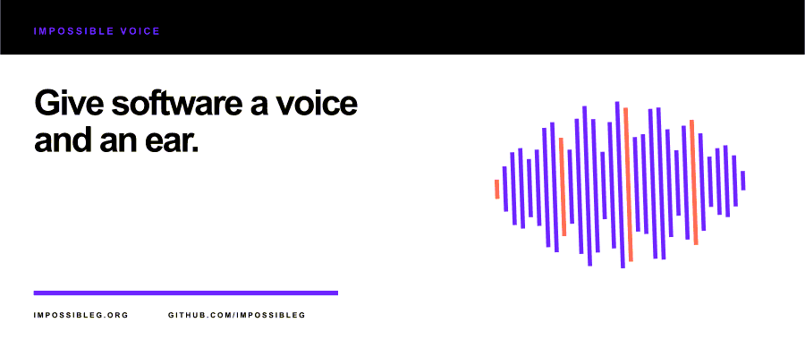

<p align="center">
  
</p>

# Impossible Voice

Impossible Voice is a ready-made, self-hosted speech-to-text and text-to-speech server. The first
release targets one curated local STT model and one curated local TTS voice with automatic,
checksum-verified installation and offline operation after setup.

The public v0.1 promise is frozen in [`docs/product-contract.md`](docs/product-contract.md). HTTP,
realtime WebSocket, gRPC, and bounded MCP transports are implemented. Native Windows and Linux
archives are built by the release workflow; a prebuilt Linux container is not published in v0.1.

<p align="center">
  
</p>

From a source checkout, install the pinned local artifacts with one command, then start the server
with one command.

PowerShell:

```powershell
./scripts/setup.ps1
./scripts/serve.ps1
```

Bash:

```bash
./scripts/setup.sh
./scripts/serve.sh
```

The equivalent direct CLI is:

```text
cargo run --locked --bin impossible-voice -- setup
cargo run --locked --bin impossible-voice -- status
cargo run --locked --bin impossible-voice -- doctor
cargo run --locked --bin impossible-voice -- serve
```

`setup` installs exactly one pinned sherpa-onnx CPU runtime, one English streaming STT model, and
one English TTS voice into the ignored `runtime-artifacts` directory. Downloads are HTTPS-only,
size- and SHA-256-verified, safely extracted into staging, fully inventoried, then atomically
activated. `setup --offline` re-verifies an existing installation without network access; `status`
is read-only. Ordinary `serve` never downloads artifacts.

The release workflow publishes a Windows ZIP and a mode-preserving Linux `tar.gz`, each with a
SHA-256 sidecar. They contain the native server, scripts, configuration, documentation, and
notices—but no runtime or model bytes. See [`docs/operations.md`](docs/operations.md) for archive
use, checksum verification, offline restart, and recovery.

`serve` binds HTTP/WebSocket/MCP to `127.0.0.1:8080` and gRPC to `127.0.0.1:50051` by default.
Configuration precedence is defaults, then an optional TOML file, then `IMPOSSIBLE_VOICE_*`
environment variables, then explicit CLI flags.
See [`config/impossible-voice.example.toml`](config/impossible-voice.example.toml). Readiness
remains false until the curated artifacts and both engines are usable.

Batch transcription:

```text
curl -F "file=@sample.wav;type=audio/wav" http://127.0.0.1:8080/v1/audio/transcriptions
```

Speech synthesis:

```text
curl -H "content-type: application/json" \
  -d '{"input":"Impossible Voice is local.","voice":"kristin","response_format":"wav"}' \
  http://127.0.0.1:8080/v1/audio/speech --output speech.wav
```

The exact HTTP, WebSocket, gRPC, and MCP contracts and bounded examples are documented in
[`docs/api.md`](docs/api.md). WebSocket and gRPC TTS chunks are emitted after native synthesis
finishes; they are bounded transport chunks, not incremental model generation.

## Development

The repository is a Rust workspace with isolated audio, artifact, native FFI, STT, TTS, protocol,
and server crates.

```text
cargo fmt --all -- --check
cargo check --locked --workspace --all-targets
cargo clippy --locked --workspace --all-targets -- -D warnings
cargo test --locked --workspace
pwsh ./scripts/test-privacy-scan.ps1
pwsh ./scripts/privacy-scan.ps1
pwsh ./scripts/verify-vendored-impossible-server.ps1
pwsh ./scripts/test-vendored-impossible-server.ps1
cargo test --locked --manifest-path vendor/impossible-server/Cargo.toml --target-dir target/foundation
```

The vendored foundation is a deliberately narrow, integrity-checked snapshot of the reusable core
and testkit. It supplies lifecycle and safety primitives; it does not supply Voice transports,
WebSockets, audio processing, inference engines, or artifact installation. See
[`docs/foundation-vendoring.md`](docs/foundation-vendoring.md).

## License

Licensed under either the Apache License, Version 2.0 or the MIT license, at your option.
